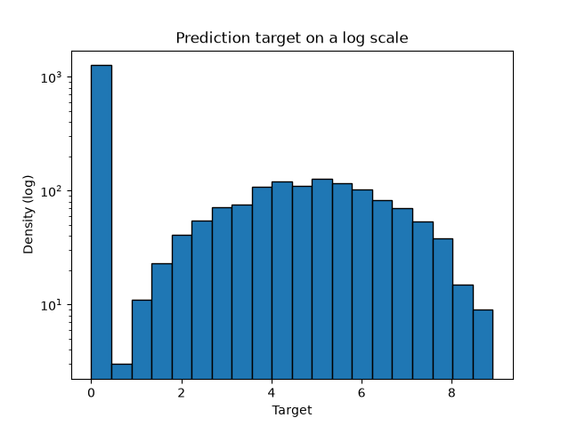
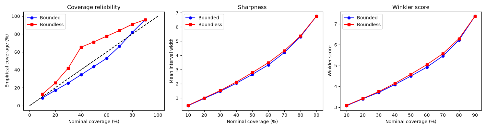
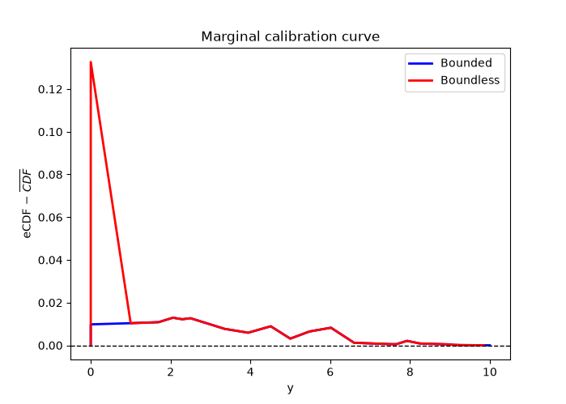
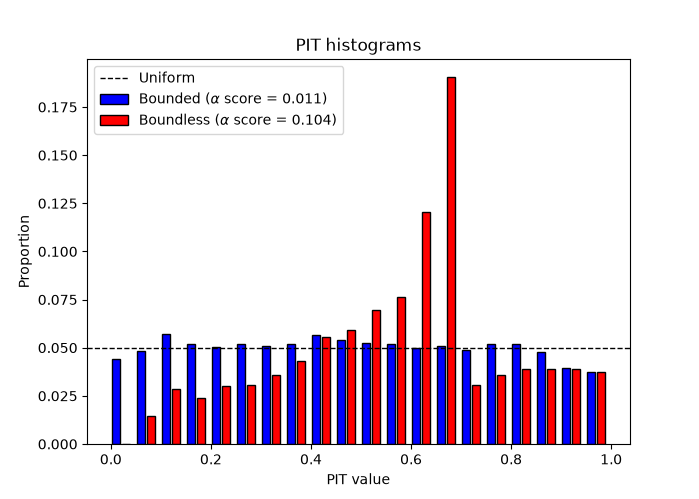

### Writing a custom mapper

`OrdBoostRegressor` accepts any custom mapper that inherits from `BaseBinMapper`.
In this example, we will show how to create a new mapper. A minimal mapper only
needs to implement the `_intra_bin_points` method that defines which points to add
between the bin edges and their associated weight.

Below is the simplest mapper to implement: the `NullBinMapper`. It does not add any
points to the grid. Therefore, the CDFs will only be evaluated at the bin edges. 

**NOTE**: This mapper is equivalent to using the UniformBinMapper with `n_points=0`.

``` python linenums="1"

```

Once the new mapper has been defined, we can now use it when creating an `OrdBoostRegressor`:

``` python linenums="1"

```

Running this example should produce the following output:

```
Sample 0 median [95% PI]
  2.76 [1.50 -- 3.10]
Sample 1 median [95% PI]
  3.60 [3.12 -- 6.76]
Sample 2 median [95% PI]
  4.44 [1.78 -- 5.15]
Sample 3 median [95% PI]
  1.96 [1.41 -- 2.49]
Sample 4 median [95% PI]
  2.98 [2.24 -- 3.92]
```

Full example:

``` python linenums="1", title="Writing a custom mapper"

```

### Bounded data and atoms

This example demonstrates the use of the `lower_bound` and `upper_bound` attributes
with and whitout atoms. We will look at the effects these have on the model.
Let's start by generating some synthetic data. For this example, we want to include
a floor atom at y=0 (zero-inflation) and a ceiling bound at y=10 with no atom.
This means that the target values y can be 0, and they approach 10 without reaching.
We are creating 10,000 samples with 8 features. We then modify the target so that
it is bound between 0 and 10, and zero-inflated (roughly 50% of data at 0).

``` python linenums="1"

```

The code should generate the following figure showing the target test distribution:



**NOTE:** the target has a large amount of data at 0 and never reaches 10.

Now that the data has been generated, we can fit our models. First, we define some
bin edges that cover the 0 to 10 range. We then create two models, one with the 
`mapper_kwargs` and one without. The models have identical hyperparameters and use
the quantile bin mapper. The first model defines four `mapper_kwargs`, the 
`lower_bound` and `upper_bound` values are floats corresponding to the limits we
have imposed on the data. The `floor_atom` is set to `True` because there is data
at 0, however, the `ceiling_atom` is set to `False` because y never reaches 10.

Once the models have been created, we can fit them with the train data and generate
the predictions and distributions. 

``` python linenums="1"

```

Now let us evaluate the model to see the effects of the bounds and atoms. First, let
us look at the accuracy and skill scores with the MAE, CRPS, and CRPSS for both 
models. 

``` python linenums="1"

```

The code will generate the following table:

```
        Bounded | Boundless
MAE:     1.712  |    1.745
CRPS:    0.993  |    1.005
CRPSS:   0.313  |    0.305
```

Both model exhibit similar performances, with the bounded model showing a marginal
improvement over the boundless model (lower CRPS and MAE and higher CPRSS). Now
let us take a look at the prediction intervals. We compute the interval coverage 
rate, the sharpness, and the Winkler score at difference significance levels and 
plot the results.

``` python linenums="1"

```

The code will generate the following results: 



Now the difference between the bounded and boundless model becomes more apparent. 
The boundless model has too much coverage, the true value falls in the interval
more often then expected. On the other hand, the bounded model has too little 
coverage. Both model have similar sharpness and Winkler scores.

Finally, let's look at the calibration. We will compute the PIT histograms and the
marginal calibration curves for both models and plot the results.

``` python linenums="1"

```

The code will generate the following results:



The marginal calibration clearly shows a difference between the bounded and the 
boundless model near 0. This is exactly where the floor atom is located. Without the
floor atom and lower bound set, the model is miscalibrated in that lower region. The
upper bound also shows an effect however much weaker than at the floor.



The PIT histograms corroborate the results from the marginal calibration. The 
boundless model systematically underestimates the target values which creates a PIT
histogram with a peak near 0.6 and $\alpha$ score of 0.104. In contrast, the bounded
model has PIT histogram that is near uniform and an $\alpha$ score of 0.011, 10 
times smaller.

These results clearly show the effects of using the atoms and bounds to constrain
the models.

Full example:

``` python linenums="1", title="Bounds and atoms"

```

---

