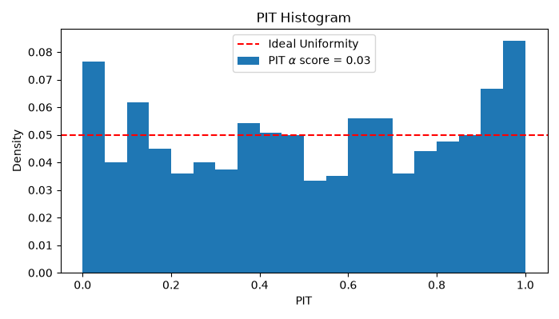
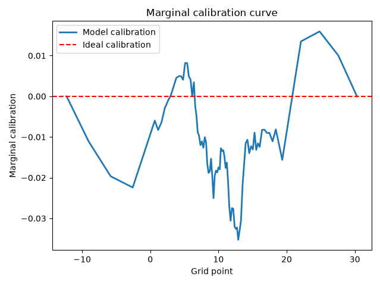

### Performance evaluation

This example demonstrates how to assess a fitted model's predictive accuracy using
`ordboost.metrics`. Three metrics are used: 
a plain point-prediction error (MAE), a proper scoring
rule over the full predicted distribution (CRPS), and a skill score
comparing the model against a naive, covariate-free baseline (CRPSS).

First let's create some synthetic data. The data is split into a train and testing
set. 

```python linenums="1"

```

Now we can create the `OrdBoostRegressor` and fit the model. We opted for showing
a model creation with most default settings. Hence, the model uses the 
`EmpiricalMedianBinMapper` as a mapping strategy and the bins are created using
the quantiles as well as the min and max values of `y_train` for a total of 11
bin edges. 

```python linenums="1"

```

Once the model has been fitted on the train data, it can be evaluated on the test
data. We are going to measure three different metrics to evaluate the accuracy
of the model. The first is the mean absolute error (MAE) between the ground truth
`y_test` outcomes and the model median predictions.

```python linenums="1"

```

The continuous ranked probability score (CRPS) is a generalisation of the MAE to
distributional predictions, such as the ones generated with `OrdBoostRegressor`. 
The `crps_score` function therefore needs the predictive distributions and not the
point-estimate predictions. 

```python linenums="1"

```

The CRPS skill score (CRPSS) compares the CRPS from a naive baseline with the CRPS
from the model. The baseline is built from the full training set, sized to match
the evaluation set (`y_test`), and represents the best achievable forecast
with zero patient/sample-specific information. Every sample gets the
same unconditional distribution. A CRPSS of 0 means no better than this
baseline; 1 is a perfect forecast; negative values are worse than the
baseline.

```python linenums="1"

```


The results should be:
```
MAE:   3.824
CRPS:  2.813
CRPSS: 0.514
```

Full example:

```python linenums="1", title="Evaluating performances with MAE, CRPS, and CRPSS"

```

### Model calibration diagnostics
Evaluating the calibration of a model is crucial to know if the predictions can be
trusted. The `OrdBoostRegressor` generates CDFs for each patient, so we use two 
different methods to evaluate the calibration in this example: the Probability
Integral Transform (PIT) and the marginal calibration curve.

First let us generate some synthetic data. We generate 6,000 samples that are 
split into a train and a test set, with 20% of data in the test set. 
The target is a linear combination of features plus purely random Gaussian noise.

``` python linenums="1"

```

Now we can fit the model to the train data and generate the predicted CDFs.
First, we create a `UniformBinMapper` that is passed to the `OrdBoostRegressor`. The
mapper will be needed later so we defined it before. However, you can always get the
fitted mapper from the regressor with `reg.mapper_`. After fitting the model, we 
estimate the distributions of the test set with `predict_dist`.

``` python linenums="1"

```

We can now compute the PIT values and plot the histogram. The `pit_diagnostics`
function returns a `Pit` object that contains all the information needed to plot
the PIT histogram. We extract the hist_values and then the $\alpha$ score which
measures the distance to the uniform distribution. 

``` python linenums="1"

```

The code show generate the following figure: 



The marginal calibartion is computed as eCDF(y) - mean predicted CDF(y),
evaluated at the fitted grid points, where eCDF(y) si the empirical CDF. A
well-calibrated model produces a curve close to zero everywhere. We can compute the
marginal calibration curve by calling the `marginal_calibration_curve` function
and plot the `grid` and `marginal_calibration` outputs.

``` python linenums="1"

```

The code show generate the following figure: 



Full example: 

``` python linenums="1", title="Evaluating model calibration"

```

### Evaluating prediction intervals

This example demonstrates how the prediction intervals can be evaluated.
Three metrics are computed to evaluate the model's prediction intervals:

* **coverage**, the percentage of values that lie within the interval range at
a given significance value $\alpha$, 
* **sharpness**, the mean interval width of the intervals at a given significance
interval $\alpha$, and
* **Winkler score**, a proper scoring rule combining both coverage and sharpness.

Let us begin by generating 2,000 examples that will be divided into a train and a
test set with an 80/20 split. 

``` python linenums="1"

```

The `OrdBoostRegressor` is created with the default parameters and fitted on the
training data.

``` python linenums="1"

```

Once the model has been fitted on the training data, we can evaluate the PIs at
different significance levels. We chose 90%, 80%, and 50% here as our $\alpha$ 
values, but any value between 0 and 1 is possible. The results for the three
metrics are simply printed in a table, but they could also be plotted as a
curve if needed. This option is particularly useful when evaluating a larger range
of $\alpha$ values.

``` python linenums="1"

```

The table should be:

```
Nominal coverage | Coverage | Sharpness | Winkler score
-------------------------------------------------------
      90%        |  72.0%   |    7.76   |    18.77
      80%        |  61.5%   |    5.97   |    14.14
      50%        |  38.5%   |    3.12   |    9.05
```

Full example:

``` python linenums="1", title="Prediction interval evaluation"

```

The next [examples](advanced.md#) show more advanced features of the `ordboost` package.

---

